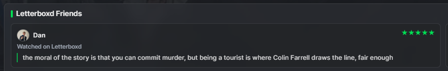

# Jellyfin.Plugin.LetterboxdSocial

> **Proof of concept — rough and unreliable. Not production ready.**
>
> This plugin is also **entirely vibe coded**. I liked the idea, so I had AI write it — no code in this repo was written by hand, and if you ask me what half of it does, I'll be reading it for the first time alongside you. It runs, which is frankly all I asked of it.
>
> This plugin is an experiment and should not be used on live Jellyfin servers. It works by scraping public Letterboxd pages — there is no official API. Scraping is slow by design (requests are deliberately throttled to avoid getting blocked), non-optimised, and will silently break if Letterboxd changes its HTML structure or tightens its bot detection. Data may be incomplete, stale, or missing entirely depending on how a user's film history is structured. Use at your own risk.

A Jellyfin server plugin that brings your Letterboxd social feed into your media library. When you open a movie in Jellyfin, the plugin shows a **Letterboxd Friends** widget on the detail page — displaying ratings, watched status, and reviews from the Letterboxd accounts you configure.



---

## What It Does

- Shows a **Letterboxd Friends** widget on movie detail pages in Jellyfin Web.
- Displays each configured friend's star rating, watched status, and review text (if they wrote one).
- Spoiler warnings are shown for reviews marked as containing spoilers, with a reveal toggle.
- Friend avatars are fetched from their Letterboxd profiles.
- Data is cached locally in a JSON file, so the widget always loads instantly from cache — the plugin never talks to Letterboxd while you browse.
- A background scheduled task refreshes the cache hourly.

## How It Works

The plugin has no access to Letterboxd's API (there isn't a public one). Instead, a scheduled task scrapes public Letterboxd pages:

- `/username/films/` and subsequent pages for ratings and watched status
- review pages for full review text when available
- RSS feeds for recent review text
- profile pages for avatars

Scraped data is stored in a JSON cache file under the Jellyfin plugin data folder. The cache is merge-only: a failed or blocked scrape never deletes previously cached data. The Jellyfin Web frontend receives a small JavaScript widget that is injected into movie detail pages and reads from this cache via a plugin API endpoint.

Letterboxd imposes anti-scraping measures on paginated film pages. The plugin uses browser-like headers and a realistic referrer chain to access deeper pages, but this is inherently fragile — Letterboxd can and does block or change these patterns.

## Requirements

- Jellyfin 10.11.x
- .NET 9 runtime (included in the Jellyfin server environment)
- Configured Letterboxd accounts must have **public profiles**

## Installing via Plugin Repository

1. In Jellyfin, go to **Dashboard → Plugins → Repositories**.
2. Add the following URL as a new repository:
   ```
   https://raw.githubusercontent.com/dcm2610/jellyfin-letterboxd-social/main/manifest.json
   ```
3. Go to **Dashboard → Plugins → Catalogue**, find **Letterboxd Social**, and install it.
4. Restart Jellyfin when prompted.

## Installing Manually

1. Download the latest zip from the [Releases](https://github.com/dcm2610/jellyfin-letterboxd-social/releases) page.
2. Extract the zip into your Jellyfin plugins folder (e.g. `/var/lib/jellyfin/plugins/LetterboxdSocial` on Linux).
3. Restart Jellyfin.

## Configuration

1. Go to **Dashboard → Plugins → Letterboxd Social**.
2. Add one entry per Letterboxd account you want to track:
   - **Letterboxd Username** — the username as it appears in their profile URL (e.g. `letterboxd.com/username`)
   - **Display Name** — the name shown on the widget card
3. Optionally adjust:
   - **Max Film Pages Per User** — how many pages of a user's film grid the scheduled scrape reads (default: 3). Higher values reach older films but make each scrape slower.
   - **Request Delay (ms)** — pause between Letterboxd requests to reduce the chance of rate limiting (default: 1000ms).
4. Save, then go to **Dashboard → Scheduled Tasks** and run **Refresh Letterboxd Social Reviews** manually to populate the cache immediately.

## Scheduled Tasks

| Task | Default interval | Purpose |
|------|-----------------|---------|
| Refresh Letterboxd Social Reviews | Every hour | Scrape all configured users into the local cache |

## Known Limitations

- **Scraping only** — no official API. Any Letterboxd site change can break scraping silently.
- **Public profiles only** — private Letterboxd accounts cannot be read.
- **Cache freshness** — new ratings and reviews appear after the next scheduled scrape, not in real time.
- **Page depth** — films beyond the configured number of film-grid pages are not scraped until the limit is raised.
- **No official endorsement** — this is a personal project, not affiliated with Jellyfin or Letterboxd.

## Building From Source

```powershell
# Using the local .NET SDK bundled with the repo
.\.dotnet\dotnet.exe publish .\Jellyfin.Plugin.LetterboxdSocial.csproj -c Release -o .\dist\LetterboxdSocial
```

Copy `dist\LetterboxdSocial\` into your Jellyfin plugins directory and restart.
